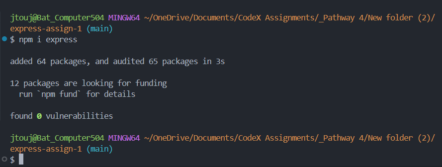
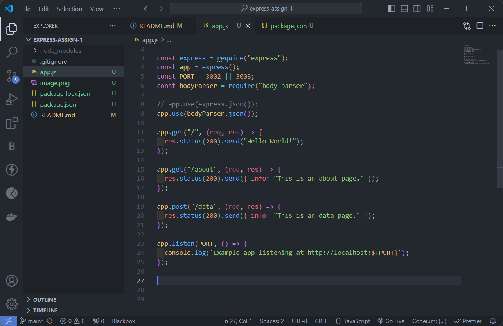

# Express-Assignment-1

Create an Express.js project and create a json.

## Express.js

```bash
npm init -y
npm install express
```



Express.js is installed.

## Nodemon

```bash
npm install nodemon
```

Nodemon is installed. It allows me to update as as changes are saved. Set up a script in my package.json to make it run.

## Body Parser

```bash
npm install body-parser
```

Installed body parcer. Body parser if a middleware software.

## JSON for pages and Information.



The above image shows the logic to make json files or information on each page.
